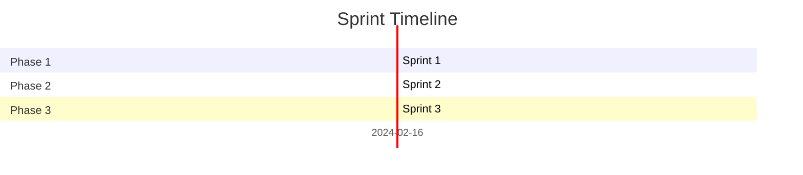

# Create Sprints from Implementation Plan

Break down an implementation plan into individual sprint files organized in a dedicated folder.

## Overview

This skill:
1. Reads an implementation plan from `_plan/`
2. Extracts each phase as a separate sprint
3. Creates a sprint folder: `_sprints/<plan-name>/`
4. Generates individual sprint markdown files
5. Adds progress tracking and checklists

## Workflow

### Step 1: Validate Input

**Parse `$ARGUMENTS`:**
- If argument is a file path: use it directly
- If argument is a plan name: search in `_plan/` for matching file
- If no argument: list available plans and ask user to choose

**Example arguments:**
````bash
# Full path
_plan/2024-02-16-userregistry-implementation.md

# Plan name (will search)
userregistry-implementation

# Date prefix
2024-02-16
````

### Step 2: Read Plan File
````bash
cat $PLAN_FILE_PATH
````

Extract:
- Plan title
- All phases (sections starting with "### Phase")
- Steps under each phase
- Total estimated time
- Design decisions

**If file doesn't exist:**
````
❌ Plan file not found: <path>

Available plans:
  - _plan/2024-02-16-userregistry-implementation.md
  - _plan/2024-02-15-another-plan.md

Usage: claude create-sprints <plan-name>
````

### Step 3: Generate Sprint Folder Name

From plan filename: `2024-02-16-userregistry-implementation.md`

Extract slug: `userregistry-implementation`

**Create folder:**
````bash
mkdir -p _sprints/userregistry-implementation
````

### Step 4: Parse Phases

**Look for phase sections:**
````markdown
### Phase 1: Configuration & Dependencies
### Phase 2: Source Contracts
### Phase 3: Scripts
````

**Extract for each phase:**
- Phase number
- Phase name
- All steps (numbered list items)
- Estimated time (if present)
- Dependencies (files needed)

### Step 5: Generate Sprint Files

**For each phase, create:**

`_sprints/<plan-name>/sprint-<phase-number>-<phase-slug>.md`

**Example:**
- `_sprints/userregistry-implementation/sprint-01-configuration-dependencies.md`
- `_sprints/userregistry-implementation/sprint-02-source-contracts.md`
- `_sprints/userregistry-implementation/sprint-03-scripts.md`

**Sprint file template:**
````markdown
# Sprint <N>: <Phase Name>

**Plan:** <Plan Title>
**Status:** 🟡 Not Started
**Estimated Time:** <X hours>
**Actual Time:** ___ hours
**Started:** ___
**Completed:** ___

---

## 🎯 Sprint Goal

<Brief description of what this sprint achieves>

---

## 📋 Tasks

<Extract all steps from this phase with checkboxes>

- [ ] Task 1
- [ ] Task 2
- [ ] Task 3

---

## 📁 Files to Create/Modify

<List of files that will be touched in this sprint>

**New Files:**
- `path/to/new/file.sol`

**Modified Files:**
- `path/to/existing/file.toml`

**Deleted Files:**
- `path/to/old/file.sol`

---

## 🔗 Dependencies

**Requires Completion Of:**
- Sprint <N-1>: <Previous Phase Name>

**Required By:**
- Sprint <N+1>: <Next Phase Name>

**External Dependencies:**
- OpenZeppelin Contracts v5
- Foundry installed

---

## ✅ Acceptance Criteria

<What must be true for this sprint to be considered "done">

- [ ] All tasks completed
- [ ] Code compiles: `forge build`
- [ ] Tests pass (if applicable)
- [ ] Code formatted: `forge fmt`
- [ ] Files committed to Git

---

## 🧪 Verification Commands
```bash
# Commands to verify this sprint is complete
forge build
forge test -vvv --match-contract <TestName>
```

---

## 📝 Notes

<Sprint-specific notes, gotchas, or important considerations>

---

## 🐛 Issues Encountered

<Track blockers and problems during implementation>

**Issue:** 
**Resolution:** 
**Time Lost:** 

---

## 📊 Sprint Retrospective

**What Went Well:**
- 

**What Could Improve:**
- 

**Action Items:**
- 

---

**Next Sprint:** sprint-<N+1>-<next-phase-slug>.md
````

### Step 6: Create Sprint Index

Create `_sprints/<plan-name>/README.md`:
````markdown
# Sprints: <Plan Title>

**Source Plan:** `_plan/<plan-file>.md`
**Created:** <ISO DateTime>
**Total Sprints:** <N>
**Estimated Total Time:** <X hours>

---

## 🏃 Sprint Overview

| Sprint | Phase | Status | Time Est. | Time Actual | Started | Completed |
|--------|-------|--------|-----------|-------------|---------|-----------|
| 1 | <Phase 1 Name> | 🟡 Not Started | <X>h | ___h | ___ | ___ |
| 2 | <Phase 2 Name> | 🟡 Not Started | <X>h | ___h | ___ | ___ |
| 3 | <Phase 3 Name> | 🟡 Not Started | <X>h | ___h | ___ | ___ |

**Status Legend:**
- 🟡 Not Started
- 🔵 In Progress
- 🟢 Complete
- 🔴 Blocked
- ⏸️ Paused

---

## 📂 Sprint Files

1. [Sprint 1: <Phase 1>](./sprint-01-<slug>.md)
2. [Sprint 2: <Phase 2>](./sprint-02-<slug>.md)
3. [Sprint 3: <Phase 3>](./sprint-03-<slug>.md)

---

## 🎯 Current Sprint

**Active:** Sprint 1 - <Phase 1 Name>
**Progress:** 0% (0/<N> tasks)

---

## 📈 Overall Progress

**Completed Sprints:** 0/<N>
**Total Progress:** 0%


---

## 🔄 Quick Commands
```bash
# Start a sprint
cd _sprints/<plan-name>
cat sprint-01-<slug>.md

# Check progress
grep -r "^\- \[x\]" . | wc -l

# Update sprint status
# Edit sprint file and README.md
```

---

## 📊 Velocity Tracking

| Sprint | Tasks | Completed | Velocity |
|--------|-------|-----------|----------|
| 1 | <N> | 0 | 0% |
| 2 | <N> | 0 | 0% |

**Average Velocity:** TBD
**Projected Completion:** TBD
````

### Step 7: Create Sprint Helper Script

Create `_sprints/<plan-name>/next-sprint.sh`:
````bash
#!/bin/bash
# Find and display the next incomplete sprint

SPRINT_DIR="$(dirname "$0")"
cd "$SPRINT_DIR" || exit 1

echo "🔍 Finding next sprint..."
echo ""

for sprint in sprint-*.md; do
    if grep -q "Status:** 🟡 Not Started" "$sprint" || grep -q "Status:** 🔵 In Progress" "$sprint"; then
        echo "📋 Next Sprint: $sprint"
        echo ""
        cat "$sprint"
        exit 0
    fi
done

echo "🎉 All sprints complete!"
````

Make executable:
````bash
chmod +x _sprints/<plan-name>/next-sprint.sh
````

### Step 8: Report Success

Output:
````
✅ Sprints created successfully!

Plan: <Plan Title>
Sprints: <N> phases
Folder: _sprints/<plan-name>/

Sprint Files Created:
  ✓ sprint-01-<phase1-slug>.md
  ✓ sprint-02-<phase2-slug>.md
  ✓ sprint-03-<phase3-slug>.md
  ✓ README.md (sprint index)
  ✓ next-sprint.sh (helper script)

Next steps:
  1. Review sprint breakdown: cat _sprints/<plan-name>/README.md
  2. Start first sprint: cat _sprints/<plan-name>/sprint-01-*.md
  3. Or use helper: ./_sprints/<plan-name>/next-sprint.sh

Quick start:
  cd _sprints/<plan-name>
  ./next-sprint.sh
````

---

## Error Handling

### Plan File Not Found
````
❌ Plan file not found: <path>

Available plans in _plan/:
  1. 2024-02-16-userregistry-implementation.md
  2. 2024-02-15-another-plan.md

Choose a plan: claude create-sprints <plan-name>
````

### No Phases Found
````
❌ No phases found in plan file

The plan must have sections formatted as:
  ### Phase 1: Name
  ### Phase 2: Name

Please check the plan file format.
````

### Sprint Folder Already Exists
````
⚠️  Sprint folder already exists: _sprints/<plan-name>/

Options:
  1. Append version: _sprints/<plan-name>-v2/
  2. Overwrite (will delete existing sprints)
  3. Abort

Choose option (1/2/3):
````

---

## Advanced Features

### Auto-detect Current Sprint

Look at Git branch and match to sprint:
````bash
git branch --show-current
# If branch is "feature/phase-1-config"
# → Highlight sprint-01 as active
````

### Git Integration

Create a branch for each sprint:
````bash
git switch -c sprint/01-configuration-dependencies
````

### Time Tracking

Add to sprint file:
````markdown
## ⏱️ Time Log

| Date | Duration | Activity |
|------|----------|----------|
| 2024-02-16 | 1.5h | Setup dependencies |
| 2024-02-16 | 2h | Created contracts |
````

---

## Example Usage
````bash
# Create sprints from plan
claude create-sprints _plan/2024-02-16-userregistry-implementation.md

# Or by plan name
claude create-sprints userregistry-implementation

# View sprint structure
ls _sprints/userregistry-implementation/

# Output:
# sprint-01-configuration-dependencies.md
# sprint-02-source-contracts.md
# sprint-03-scripts.md
# sprint-04-tests.md
# sprint-05-verification.md
# README.md
# next-sprint.sh

# Start working
cd _sprints/userregistry-implementation
./next-sprint.sh
````

---

## Best Practices

1. **One phase = One sprint** - Keep sprints focused
2. **Clear acceptance criteria** - Know when sprint is done
3. **Track time** - Improve estimates over time
4. **Update status** - Keep README.md current
5. **Git branches** - One branch per sprint
6. **Retrospectives** - Learn from each sprint

---

## Integration with Other Skills

### With feature-spec-creator
````bash
# Create spec → Plan → Sprints
claude feature-spec-creator "Feature name"
claude save-plan "Feature implementation"
claude create-sprints <plan-name>
````

### With Git
````bash
# Auto-create sprint branches
git switch -c sprint/01-phase-name
````

---

## Folder Structure After Running
````
_plan/
└── 2024-02-16-userregistry-implementation.md

_sprints/
└── userregistry-implementation/
    ├── README.md
    ├── next-sprint.sh
    ├── sprint-01-configuration-dependencies.md
    ├── sprint-02-source-contracts.md
    ├── sprint-03-scripts.md
    ├── sprint-04-tests.md
    └── sprint-05-verification.md
````

---

**Version:** 1.0.0